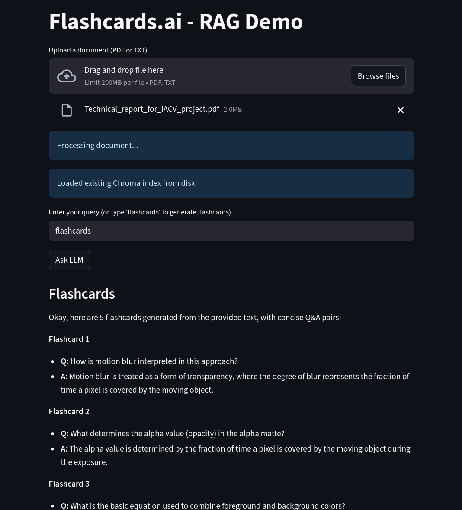

# Flashcards.ai

> Demo for **Google DSC AI Hack 2024** – *Flashcards.ai* is a lightweight RAG-based flashcard and Q&A system that quizzes you on content from an uploaded PDF or TXT file.  
> Powered locally using **Ollama** with **Google’s Gemma 3** model and **GemmaEmbedding**.

---

## Preview


---

## Features
1) Upload a **PDF** or **TXT** file.  
2) Perform **document Q&A** with Retrieval-Augmented Generation (RAG).  
3) Generate 5 **flashcards** from random document chunks to quiz yourself.  
4) Runs **fully local** with Ollama, no external API required.

---

## Installation

### 1. Clone this repository
### 2. Install dependencies
```
pip install -r requirements.txt
```
### 3. (Install Ollama)[https://ollama.com/] & pull models
```
ollama pull gemma3
ollama pull embeddinggemma
```
### 4. Usage
Run the Streamlit app:
```
streamlit run app.py
```

